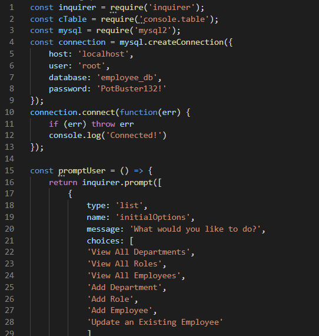

# zpl-employee-tracker-1 
  ## Description
  
  - What was my motivation? I wanted to create an application utilizing MySQL2, Inquirer, Node.js that tracks a company's departments, roles, and employees for organization and business purposes.
  - Why did I build this project? I built this project to test my MySQL skills in creating a real-world, practical application.
  - What problem does it solve? It solves the issue of having to rebuild an entire MySQL table every time a user wants to update one row or column of data.
  - What did I learn? I learned how to utilize MySQL in conjunction with Inquirer and Node.js to create an application that users can use comfortably in a terminal. 
  - What makes my project stand out? My project contains comments that make it more readable and easy to follow for other developers.

  ## Challenges
  - One of the challenges I struggled during the development of this project was running queries from the `index.js` file and rendering it based on the user's choice for the initial prompt.
  
  ## User Story
AS A business owner
I WANT to be able to view and manage the departments, roles, and employees in my company
SO THAT I can organize and plan my business

## Acceptance Criteria
GIVEN a command-line application that accepts user input
WHEN I start the application
THEN I am presented with the following options: view all departments, view all roles, view all employees, add a department, add a role, add an employee, and update an employee role

WHEN I choose to view all departments
THEN I am presented with a formatted table showing department names and department ids

WHEN I choose to view all roles
THEN I am presented with the job title, role id, the department that role belongs to, and the salary for that role

WHEN I choose to view all employees
THEN I am presented with a formatted table showing employee data, including employee ids, first names, last names, job titles, departments, salaries, and managers that the employees report to

WHEN I choose to add a department
THEN I am prompted to enter the name of the department and that department is added to the database

WHEN I choose to add a role
THEN I am prompted to enter the name, salary, and department for the role and that role is added to the database

WHEN I choose to add an employee
THEN I am prompted to enter the employee’s first name, last name, role, and manager, and that employee is added to the database

WHEN I choose to update an employee role
THEN I am prompted to select an employee to update and their new role and this information is updated in the database
  ## Table of Contents
  
  - [Description](#description)
  - [Usage](#usage)
  - [License](#license)

  ## Usage

  
  [Demonstration Video](https://youtu.be/BXdA2GWe5Fc)

  ## License

  [] (https://opensource.org/licenses/MIT)

  ---

  ## Questions?
  If you have any questions, check out my [GitHub profile](https://github.com/zachary-levin) at or email me at [zlevin706@gmail.com](mailto:zlevin706@gmail.com)

